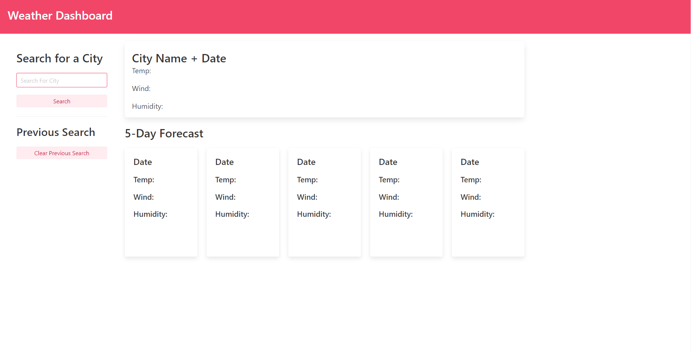
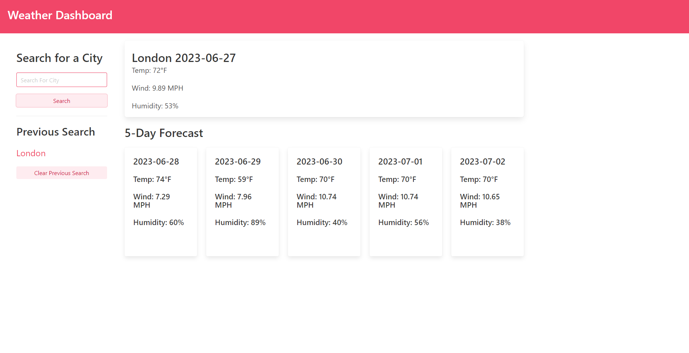

# Weather-Dashboard

## Description
Weather Dashboard is a web application that was made so you can find out the current weather forercast of whatever city you search, along with a forecast for the next 5 days. It will show the city you searched for last. 

## Table of Contents (Optional)

- [Installation](#installation)

- [Usage](#usage)

- [Credits](#credits)

- [License](#license)

## Installation

Head to the webpage:  https://brownkasey.github.io/Weather-Dashboard

## Usage
Head to the webpage: https://brownkasey.github.io/Weather-Dashboard

Once you're on the webpage you will be greeted with the page below.

    

You can use the search bar to search for a city, then click the search button. The current day forecast and 5 day forecast will populate with the temperature, the wind speed, and humidity percentage as shown below.

    

When click the search button, the city you searched for will be shown under your previous search. You can click the Clear Previous Search button and it will remove your previous search. 

## Credits

Coding bootcamp Readme Template:

https://coding-boot-camp.github.io/full-stack/github/professional-readme-guide

## License

Refer to LICENSE in the repo.

---
